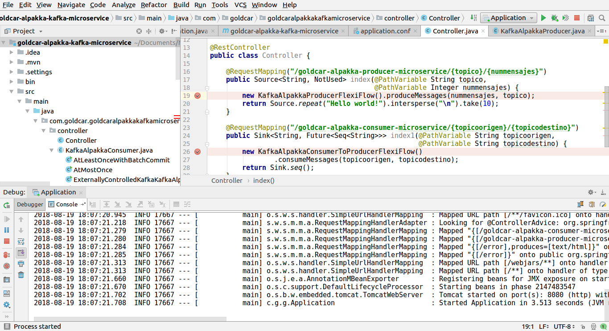

# Autoscaling Spring Boot Alpakka Kafka microservices with the Horizontal Pod Autoscaler and custom metrics on Kubernetes

Alpakka is Lightbend's way of solving the Reactive Enterprise Integration problem.
They do so by providing a collection of streaming plug-and-play connectors to various technologies.

In this PoC we'd like to test one specific integration, the Kafka Reactive Streams connector. This will be included in
a Spring Boot application with two rest endpoints, one to produce N messages in a topic, and one to consume messages from a
source topic and replicating them to a destination topic.

We will also add rest endpoints for these Consumer functionalities:

    • ConsumerWithPerPartitionBackpressure
    • RebalanceListenerCallbacks
    • ConsumerAtLeastOnce
    • ConsumerAtMostOnce
    • [github/akka/alpakka/doc-examples/src/main/java/csvsamples/](https://github.com/akka/alpakka/blob/e8ac367cad298c9e866db09db96938f1638006ad/doc-examples/src/main/java/csvsamples/FetchHttpEvery30SecondsAndConvertCsvToJsonToKafkaInJava.java)

And we will implement also rest endpoints for these Transactions functionalitites:

    • TransactionsSink
    • TransactionsFailureRetry


We will also modify these microservices so that they authenticate to Kafka using *Kerberos authentication and authorization*

The resulting application will be bundled in a Docker container image that will be deployed as a Kubernetes application.
This application will be an example of Reactive microservices, communicating between them by subscribing to a Kafka topic,
producing and consuming messages in a backpressure fashion. Microservices metrics will be collected in Grafana, and we will
launch a workload to test the Kubernetes HPA autoscale feature.


## TESTING THE ALPAKKA KAFKA CONNECTOR


See the [Alpakka kafka connector documentation](https://doc.akka.io/docs/akka-stream-kafka/current/home.html)

Clone the project locally:

```bash
tarin.mistralbs@PORTATIL-192~/Documents/2018-08-13 OTD-129. PoC Reactive Microservices communication through Kafka topics using Alpakka
  $ git clone https://github.com/akka/alpakka-kafka.git
Cloning into 'alpakka-kafka'...
remote: Counting objects: 9105, done.
remote: Compressing objects: 100% (108/108), done.
remote: Total 9105 (delta 43), reused 189 (delta 39), pack-reused 8887
Receiving objects: 100% (9105/9105), 1.50 MiB | 2.13 MiB/s, done.
Resolving deltas: 100% (3510/3510), done.
```

Run Kafka locally:

```bash
arturotarin@QOSMIO-X70B:~
 $ ~/Downloads/kafka_2.12-2.0.0/bin/zookeeper-server-start.sh ~/Downloads/kafka_2.12-2.0.0/config/zookeeper.properties  > /dev/null 2>&1 &
arturotarin@QOSMIO-X70B:~
 $ ~/Downloads/kafka_2.12-2.0.0/bin/kafka-server-start.sh ~/Downloads/kafka_2.12-2.0.0/config/server.properties  > /dev/null 2>&1 &
```

Run the project to check the Alpakka kafka connector included in the downloaded Alpakka repository:


## INTEGRATING THE ALPAKKA CONNECTOR IN A SPRING BOOT APPLICATION

For this demo we are going to take advantage of the new integration that has been landed in [Alpakka](https://github.com/akka/akka.github.com/blob/master/blog/_posts/2017-10-23-native-akka-streams-in-spring-web-and-boot-via-alpakka.md):
it can be integrated in Spring web and Spring boot applications.

This feature allows us to seamlessly integrate with our akka.stream.javadsl or
akka.stream.scaladsl.Source types in our Spring Web applications, and have them be understood by Spring natively, thanks to
the fact that Akka Streams is one of the first libraries to provide native support for Java 9's
java.util.concurrent.Flow.* (as of writing, Spring does not provide this support yet, while RxJava provides bridges separately packaged),
so if we're looking for a future-ready Reactive Streams implementation, it's as simple as using Akka Streams 2.5.6+ and we're ready to go.

Let's go!

### Create a Spring Boot project using Spring Boot Initializr


Open the application with IntelliJ, add a rest endpoint in the application controller
in order to include our Reactive Alpakka microservice and run it:


And execute the application


### Add parameterizered Producer and Consumer endpoints to the Spring Boot application

Our testing approach will be to have the Producer and Consumer microservices rest endpoints parameterized,
so that we can easily link calls between microservices that are transfering data between them, chaining their
calls in a network of communications through the Alpakka reactive connectors that they're using in their
implementations.


To do this we modify the Spring Boot controller adding these two endpoints:




### Example 1: Testing the communication between 1 Producer and 1 Consumer

1) Call the Producer microservice endpoint in order to create 3 messages in a Kafka topic called "topicoejemplo":

```bash

    http://localhost:8080/goldcar-alpakka-producer-microservice/topicoejemplo/3
```

The execution will create the messages as seen below:


2) Call the Consumer microservice endpoint in order to consume the messages inserted in the "topicoejemplo"
and replicate them into the "topicodestino" a more sophisticated microservice would deal with the consumed messages
to make some transactions, persist them in a database or make some calculations and display the results in the screen,
but this is enougth for our testing purposes. This would be the endpoint that we should call to do so:

```bash
http://localhost:8080/goldcar-alpakka-consumer-microservice/topicoejemplo/topicodestino
```

The execution will replicate the messages from "topicoejemplo" to "topicodestino" as seen below:


Now, any other microservice can consume the messages produced into "topicodestino".

### Example 2: Testing the communication between 1 Producer and a chain of Consumers


### Examples conclusion

This would be the initial approach of our implementation of microservices, enabling a workflow communication
using Reactive microservices based on Alpakka conenctors.


## PACKAGING OUR MICROSERVICE APPLICATION IN A CONTAINER IMAGE, DEPLOYING IT IN KUBERNETES, COLLECTING MICROSERVICE METRICS IN GRAFANA AND VERIFYING THAT HPA AUTOSCALING WORKS

### Prerequisites

***Minikube***

You should have minikube installed.

You should start minikube with at least 4GB of RAM:

```bash
minikube start \
  --memory 4096 \
  --extra-config=controller-manager.horizontal-pod-autoscaler-upscale-delay=1m \
  --extra-config=controller-manager.horizontal-pod-autoscaler-downscale-delay=2m \
  --extra-config=controller-manager.horizontal-pod-autoscaler-sync-period=10s
```


> If you're using a pre-existing minikube instance, you can resize the VM by destroying it an recreating it. Just adding the `--memory 4096` won't have any effect.

You should install `jq` — a lightweight and flexible command-line JSON processor.

You can find more [info about `jq` on the official website](https://github.com/stedolan/jq).


***Docker EE trial***


Alternatively, you can use the Docker EE trial link:


### Installing Custom Metrics Api


Deploy the Metrics Server in the `kube-system` namespace:

```bash
kubectl create -f monitoring/metrics-server
```


After one minute the metric-server starts reporting CPU and memory usage for nodes and pods.

View nodes metrics:

```bash
kubectl get --raw "/apis/metrics.k8s.io/v1beta1/nodes" | jq .
```


View pods metrics:

```bash
kubectl get --raw "/apis/metrics.k8s.io/v1beta1/pods" | jq .
```


Create the monitoring namespace:

```bash
kubectl create -f monitoring/namespaces.yaml
```

Deploy Prometheus v2 in the monitoring namespace:

```bash
kubectl create -f monitoring/prometheus
```

Deploy the Prometheus custom metrics API adapter:

```bash
kubectl create -f monitoring/custom-metrics-api
```

List the custom metrics provided by Prometheus:

```bash
kubectl get --raw "/apis/custom.metrics.k8s.io/v1beta1" | jq .
```


Get the FS usage for all the pods in the `monitoring` namespace:

```bash
kubectl get --raw "/apis/custom.metrics.k8s.io/v1beta1/namespaces/monitoring/pods/*/fs_usage_bytes" | jq .
```


### Package the application

You package the application as a container with:

```bash
eval $(minikube docker-env)
docker build -t goldcar-alpakka-kafka-microservice .
```


### Deploying the sample Tomcat application

In order to check that Kubernetes deployments are working, before deploying our microservices,
let's make a quick test with a Tomcat deployment:

```bash
arturotarin@QOSMIO-X70B:~/Documents/Mistral/2018-08-13 OTD-129. PoC Reactive Microservices communication through Kafka topics using Alpakka/goldcar-alpakka-kafka-microservice
$ cat kube/tomcattest.yaml
---
apiVersion: apps/v1beta2
kind: Deployment
metadata:
  name: tomcat-deployment
spec:
  selector:
    matchLabels:
      app: tomcat
  replicas: 1
  template:
    metadata:
      labels:
        app: tomcat
    spec:
      containers:
      - name: tomcat
        image: tomcat:9.0
        ports:
        - containerPort: 8080

arturotarin@QOSMIO-X70B:~/Documents/Mistral/2018-08-13 OTD-129. PoC Reactive Microservices communication through Kafka topics using Alpakka/goldcar-alpakka-kafka-microservice
$ kubectl get pod
NAME                                 READY     STATUS             RESTARTS   AGE
backend-ff99c84bd-lgpgq              0/1       CrashLoopBackOff   19         42m
frontend-7676854fcd-hb8vs            0/1       CrashLoopBackOff   19         42m
tomcat-deployment-56ff5c79c5-8tnz9   1/1       Running            0          1m

arturotarin@QOSMIO-X70B:~/Documents/Mistral/2018-08-13 OTD-129. PoC Reactive Microservices communication through Kafka topics using Alpakka/goldcar-alpakka-kafka-microservice
$ kubectl expose deployment tomcat-deployment –-type=NodePort
service "tomcat-deployment" exposed

$ kubectl describe deployment tomcat-deployment
Name:                   tomcat-deployment
Namespace:              default
CreationTimestamp:      Mon, 20 Aug 2018 08:54:00 +0200
Labels:                 <none>
Annotations:            deployment.kubernetes.io/revision=1
Selector:               app=tomcat
Replicas:               1 desired | 1 updated | 1 total | 1 available | 0 unavailable
StrategyType:           RollingUpdate
MinReadySeconds:        0
RollingUpdateStrategy:  25% max unavailable, 25% max surge
Pod Template:
  Labels:  app=tomcat
  Containers:
   tomcat:
    Image:        tomcat:9.0
    Port:         8080/TCP
    Environment:  <none>
    Mounts:       <none>
  Volumes:        <none>
Conditions:
  Type           Status  Reason
  ----           ------  ------
  Available      True    MinimumReplicasAvailable
  Progressing    True    NewReplicaSetAvailable
OldReplicaSets:  <none>
NewReplicaSet:   tomcat-deployment-56ff5c79c5 (1/1 replicas created)
Events:
  Type    Reason             Age   From                   Message
  ----    ------             ----  ----                   -------
  Normal  ScalingReplicaSet  4m    deployment-controller  Scaled up replica set tomcat-deployment-56ff5c79c5 to 1

```

### Deploying the application

Deploy the application in Kubernetes with:

```bash
$ cat kube/deployment.yaml
---
apiVersion: extensions/v1beta1
kind: Deployment
metadata:
  name: backend
spec:
  replicas: 1
  template:
    metadata:
      labels:
        app: backend
      annotations:
        prometheus.io/scrape: 'true'
    spec:
      containers:
      - name: backend
        image: goldcar-alpakka-kafka-microservice
        imagePullPolicy: IfNotPresent
        env:
        - name: ACTIVEMQ_BROKER_URL
          value: "tcp://queue:61616"
        - name: STORE_ENABLED
          value: "false"
        - name: WORKER_ENABLED
          value: "true"
        ports:
          - containerPort: 8080
        livenessProbe:
          initialDelaySeconds: 5
          periodSeconds: 5
          httpGet:
            path: /health
            port: 8080
        resources:
          limits:
            memory: 512Mi
---
apiVersion: v1
kind: Service
metadata:
  name: backend
spec:
  ports:
  - nodePort: 31000
    port: 80
    targetPort: 8080
  selector:
    app: backend
  type: NodePort
---
apiVersion: extensions/v1beta1
kind: Deployment
metadata:
  name: frontend
spec:
  replicas: 1
  template:
    metadata:
      labels:
        app: frontend
    spec:
      containers:
      - name: frontend
        image: goldcar-alpakka-kafka-microservice
        imagePullPolicy: IfNotPresent
        env:
        - name: ACTIVEMQ_BROKER_URL
          value: "tcp://queue:61616"
        - name: STORE_ENABLED
          value: "true"
        - name: WORKER_ENABLED
          value: "false"
        ports:
          - containerPort: 8080
        livenessProbe:
          initialDelaySeconds: 5
          periodSeconds: 5
          httpGet:
            path: /health
            port: 8080
        resources:
          limits:
            memory: 512Mi
---
apiVersion: v1
kind: Service
metadata:
  name: frontend
spec:
  ports:
  - nodePort: 32000
    port: 80
    targetPort: 8080
  selector:
    app: frontend
  type: NodePort

$ kubectl create -f kube/deployment.yaml
```


You can visit the application at http://minkube-ip:32000


It's not working. Seems to be crashing all the time:


Let's explore the application in the Kubernetes User interface:


You can send messages to the queue by visiting http://<minkube ip>:32000/submit

You should be able to see the number of pending messages from http://<minkube ip>:32000/metrics and from the custom metrics endpoint:

```bash
kubectl get --raw "/apis/custom.metrics.k8s.io/v1beta1/namespaces/default/pods/*/messages" | jq .
```

### Autoscaling workers

You can scale the application in proportion to the number of messages in the queue with the Horizontal Pod Autoscaler. You can deploy the HPA with:

```bash
kubectl create -f kube/hpa.yaml
```

You can send more traffic to the application with:

```bash
while true; do sleep 0.5; curl -s http://<minikube ip>:32000/submit; done
```

When the application can't cope with the number of icoming messages, the autoscaler increases the number of pods only every 3 minutes.

You may need to wait three minutes before you can see more pods joining the deployment with:

```bash
kubectl get pods
```

The autoscaler will remove pods from the deployment every 5 minutes.

You can inspect the event and triggers in the HPA with:

```bash
kubectl get hpa spring-boot-hpa
```

### Appendix

Using the secrets checked in the repository to deploy the Prometheus adapter is not recommended.

You should generate your own secrets.

But before you do so, make sure you install `cfssl` - a command line tool and an HTTP API server for signing, verifying, and bundling TLS certificates
                      
You can find more [info about `cfssl` on the official website](https://github.com/cloudflare/cfssl).

Once `cfssl` is installed you generate a new Kubernetes secret with:

```bash
make certs
```

You should redeploy the Prometheus adapter.


## IMPROVING OUR SPRING BOOT MICROSERVICES

### Adding new Consumer and Transactional microservices to our application

As we said before, We will also add rest endpoints for these Consumer functionalities:

    • ConsumerWithPerPartitionBackpressure
    • RebalanceListenerCallbacks
    • ConsumerAtLeastOnce
    • ConsumerAtMostOnce
    • [github/akka/alpakka/doc-examples/src/main/java/csvsamples/](https://github.com/akka/alpakka/blob/e8ac367cad298c9e866db09db96938f1638006ad/doc-examples/src/main/java/csvsamples/FetchHttpEvery30SecondsAndConvertCsvToJsonToKafkaInJava.java)

And we will implement also rest endpoints for these Transactions functionalitites:

    • TransactionsSink
    • TransactionsFailureRetry

### Build secured Docker container images for our microservices

New Poc collected in the ODT-123 list.

### Connecting our microservices to a Kafka secured with Kerberos

We will authenticate our microservices Kafka connections

### Use Kafka Connect JDBC and KSQL

New Poc collected in the ODT-123 list.

### Manage partial failures communication between microservices using the Netflix opensource platform in combination with Alpakka

New Poc collected in the ODT-123 list.

### NGINX Plus Pocs

New Poc collected in the ODT-123 list.

* Nginx service discovery and load balancing
* NGINX security layer: ModSecurity, OWASP core rule set, DDOS mitigation, Rate limiting, Secure Interporcesses Communication
  (TLS termination with SSL communication between services)


### Build a Machine Learning speculative Modl Serving algorithm

New Poc collected in the ODT-123 list.


## USING LAGOM: AN OPENSOURCE MICROSERVICES FRAMEWORK

[Lagom](https://www.lightbend.com/lagom-framework) is an *Opinionated microservice framework* built on Akka and Play.

This is an open source microservices framework that will help us to develop distributed systems faster and easier than
linking our microservices by ourselves, even if we use the Alpakka connectors in the way we said before, in combination with NGINX,
Netflix development tools and any other aid that we may want to use.

That's because as Lightbend experience arises, most microservices frameworks focus on helping you build fragile, single instance
microservices - which, by definition, aren’t scalable or resilient. In contrast, Lagom helps us build microservices as systems —
Reactive systems, to be precise — so that our microservices are elastic and resilient from within.

Building Reactive Systems can be hard, but Lagom abstracts the complexities away. Akka and Play do the heavy lifting so we can focus
on a simpler event-driven programming model on top, while benefitting from a message-driven system under the hood.

Lagom also provides a development environment that relieves us from tedious setup and scripting - using a single command to build
our project and start our services.

And the good news are that our Java team will not need to learn Play, Akka or any other new languages,
because [Lagom is also prepared to run Java microservices](https://developer.lightbend.com/start/?group=lagom&project=lagom-java-maven)

