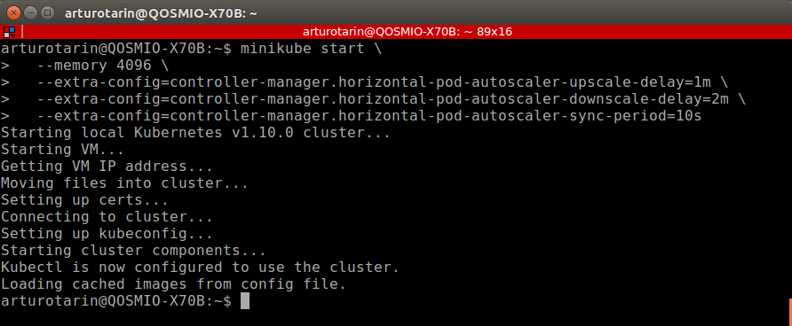
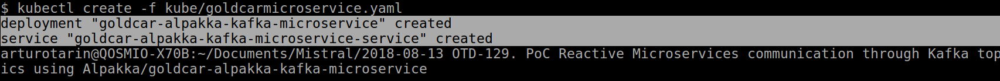
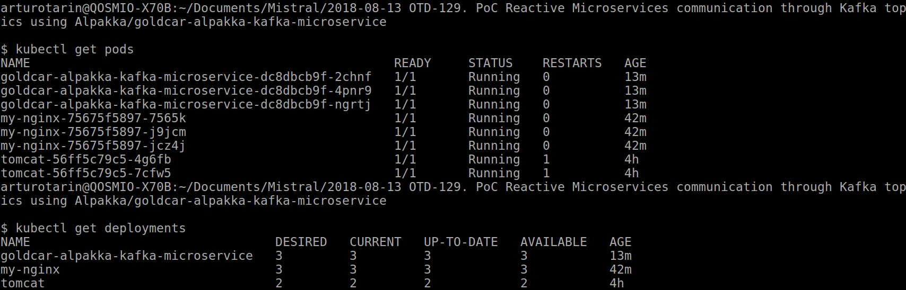

# Autoscaling Spring Boot with the Horizontal Pod Autoscaler and custom metrics on Kubernetes

## Prerequisites

You should have minikube installed.

You should start minikube with at least 4GB of RAM:

```bash
minikube start \
  --memory 4096 \
  --extra-config=controller-manager.horizontal-pod-autoscaler-upscale-delay=1m \
  --extra-config=controller-manager.horizontal-pod-autoscaler-downscale-delay=2m \
  --extra-config=controller-manager.horizontal-pod-autoscaler-sync-period=10s
```




> If you're using a pre-existing minikube instance, you can resize the VM by destroying it an recreating it. Just adding the `--memory 4096` won't have any effect.

You should install `jq` — a lightweight and flexible command-line JSON processor.

You can find more [info about `jq` on the official website](https://github.com/stedolan/jq).

## Installing Custom Metrics Api


Deploy the Metrics Server in the `kube-system` namespace:

```bash
kubectl create -f monitoring/metrics-server
```

After one minute the metric-server starts reporting CPU and memory usage for nodes and pods.

View nodes metrics:

```bash
kubectl get --raw "/apis/metrics.k8s.io/v1beta1/nodes" | jq .
```


View pods metrics:

```bash
kubectl get --raw "/apis/metrics.k8s.io/v1beta1/pods" | jq .
```


Create the monitoring namespace:

```bash
kubectl create -f monitoring/namespaces.yaml
```

Deploy Prometheus v2 in the monitoring namespace:

```bash
kubectl create -f monitoring/prometheus
```

Deploy the Prometheus custom metrics API adapter:

```bash
kubectl create -f monitoring/custom-metrics-api
```

List the custom metrics provided by Prometheus:

```bash
kubectl get --raw "/apis/custom.metrics.k8s.io/v1beta1" | jq .
```


Get the FS usage for all the pods in the `monitoring` namespace:

```bash
kubectl get --raw "/apis/custom.metrics.k8s.io/v1beta1/namespaces/monitoring/pods/*/fs_usage_bytes" | jq .
```


## Package the application

You package the application as a container with:

```bash
eval $(minikube docker-env)
docker build -t goldcar-alpakka-kafka-microservice .
```


## Deploying the sample Tomcat application

In order to check that Kubernetes deployments are working, before deploying our microservices,
let's make a quick test with a Tomcat deployment:

```bash
arturotarin@QOSMIO-X70B:~/Documents/Mistral/2018-08-13 OTD-129. PoC Reactive Microservices communication through Kafka topics using Alpakka/goldcar-alpakka-kafka-microservice
$ cat kube/tomcattest.yaml
---
apiVersion: apps/v1beta2
kind: Deployment
metadata:
  name: tomcat-deployment
spec:
  selector:
    matchLabels:
      app: tomcat
  replicas: 1
  template:
    metadata:
      labels:
        app: tomcat
    spec:
      containers:
      - name: tomcat
        image: tomcat:9.0
        ports:
        - containerPort: 8080

arturotarin@QOSMIO-X70B:~/Documents/Mistral/2018-08-13 OTD-129. PoC Reactive Microservices communication through Kafka topics using Alpakka/goldcar-alpakka-kafka-microservice
$ kubectl get pod
NAME                                 READY     STATUS             RESTARTS   AGE
backend-ff99c84bd-lgpgq              0/1       CrashLoopBackOff   19         42m
frontend-7676854fcd-hb8vs            0/1       CrashLoopBackOff   19         42m
tomcat-deployment-56ff5c79c5-8tnz9   1/1       Running            0          1m

arturotarin@QOSMIO-X70B:~/Documents/Mistral/2018-08-13 OTD-129. PoC Reactive Microservices communication through Kafka topics using Alpakka/goldcar-alpakka-kafka-microservice
$ kubectl expose deployment tomcat-deployment –-type=NodePort
service "tomcat-deployment" exposed

$ kubectl describe deployment tomcat-deployment
Name:                   tomcat-deployment
Namespace:              default
CreationTimestamp:      Mon, 20 Aug 2018 08:54:00 +0200
Labels:                 <none>
Annotations:            deployment.kubernetes.io/revision=1
Selector:               app=tomcat
Replicas:               1 desired | 1 updated | 1 total | 1 available | 0 unavailable
StrategyType:           RollingUpdate
MinReadySeconds:        0
RollingUpdateStrategy:  25% max unavailable, 25% max surge
Pod Template:
  Labels:  app=tomcat
  Containers:
   tomcat:
    Image:        tomcat:9.0
    Port:         8080/TCP
    Environment:  <none>
    Mounts:       <none>
  Volumes:        <none>
Conditions:
  Type           Status  Reason
  ----           ------  ------
  Available      True    MinimumReplicasAvailable
  Progressing    True    NewReplicaSetAvailable
OldReplicaSets:  <none>
NewReplicaSet:   tomcat-deployment-56ff5c79c5 (1/1 replicas created)
Events:
  Type    Reason             Age   From                   Message
  ----    ------             ----  ----                   -------
  Normal  ScalingReplicaSet  4m    deployment-controller  Scaled up replica set tomcat-deployment-56ff5c79c5 to 1

```

## Deploying the application

Deploy the application in Kubernetes with:

```bash
$ cat kube/deployment.yaml
---
apiVersion: extensions/v1beta1
kind: Deployment
metadata:
  name: backend
spec:
  replicas: 1
  template:
    metadata:
      labels:
        app: backend
      annotations:
        prometheus.io/scrape: 'true'
    spec:
      containers:
      - name: backend
        image: goldcar-alpakka-kafka-microservice
        imagePullPolicy: IfNotPresent
        env:
        - name: ACTIVEMQ_BROKER_URL
          value: "tcp://queue:61616"
        - name: STORE_ENABLED
          value: "false"
        - name: WORKER_ENABLED
          value: "true"
        ports:
          - containerPort: 8080
        livenessProbe:
          initialDelaySeconds: 5
          periodSeconds: 5
          httpGet:
            path: /health
            port: 8080
        resources:
          limits:
            memory: 512Mi
---
apiVersion: v1
kind: Service
metadata:
  name: backend
spec:
  ports:
  - nodePort: 31000
    port: 80
    targetPort: 8080
  selector:
    app: backend
  type: NodePort
---
apiVersion: extensions/v1beta1
kind: Deployment
metadata:
  name: frontend
spec:
  replicas: 1
  template:
    metadata:
      labels:
        app: frontend
    spec:
      containers:
      - name: frontend
        image: goldcar-alpakka-kafka-microservice
        imagePullPolicy: IfNotPresent
        env:
        - name: ACTIVEMQ_BROKER_URL
          value: "tcp://queue:61616"
        - name: STORE_ENABLED
          value: "true"
        - name: WORKER_ENABLED
          value: "false"
        ports:
          - containerPort: 8080
        livenessProbe:
          initialDelaySeconds: 5
          periodSeconds: 5
          httpGet:
            path: /health
            port: 8080
        resources:
          limits:
            memory: 512Mi
---
apiVersion: v1
kind: Service
metadata:
  name: frontend
spec:
  ports:
  - nodePort: 32000
    port: 80
    targetPort: 8080
  selector:
    app: frontend
  type: NodePort

$ kubectl create -f kube/deployment.yaml
```







You can visit the application at http://minkube-ip:32000


It's not working. Seems to be crashing all the time:


Let's explore the application in the Kubernetes User interface:


You can send messages to the queue by visiting http://<minkube ip>:32000/submit

You should be able to see the number of pending messages from http://<minkube ip>:32000/metrics and from the custom metrics endpoint:

```bash
kubectl get --raw "/apis/custom.metrics.k8s.io/v1beta1/namespaces/default/pods/*/messages" | jq .
```

## Autoscaling workers

You can scale the application in proportion to the number of messages in the queue with the Horizontal Pod Autoscaler. You can deploy the HPA with:

```bash
kubectl create -f kube/hpa.yaml
```

You can send more traffic to the application with:

```bash
while true; do sleep 0.5; curl -s http://<minikube ip>:32000/submit; done
```

When the application can't cope with the number of icoming messages, the autoscaler increases the number of pods only every 3 minutes.

You may need to wait three minutes before you can see more pods joining the deployment with:

```bash
kubectl get pods
```

The autoscaler will remove pods from the deployment every 5 minutes.

You can inspect the event and triggers in the HPA with:

```bash
kubectl get hpa spring-boot-hpa
```

## Appendix

Using the secrets checked in the repository to deploy the Prometheus adapter is not recommended.

You should generate your own secrets.

But before you do so, make sure you install `cfssl` - a command line tool and an HTTP API server for signing, verifying, and bundling TLS certificates
                      
You can find more [info about `cfssl` on the official website](https://github.com/cloudflare/cfssl).

Once `cfssl` is installed you generate a new Kubernetes secret with:

```bash
make certs
```

You should redeploy the Prometheus adapter.